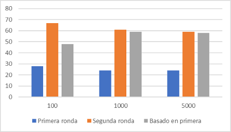

Predictor De Votaciones
=====================

La clasificación es aquel proceso que nos permite asignar objetos a diferentes categorías predefinidas, un modelo de clasificación intenta extraer alguna conclusión de los valores observados. Dadas una o más entradas al modelo de clasificación, intentaremos predecir el valor de uno o más resultados. Los resultados son etiquetas que se pueden aplicar a un conjunto de datos. Por ejemplo, al filtrar correos electrónicos "spam" o "no spam"

En este proyecto se realizaron múltiples modelos de clasificación que nos permiten predecir los votos de las elecciones del año 2018 en Costa Rica (primera ronda, segunda ronda y segunda ronda basandonos en los votos de la primera), basándose para esto en un conjunto de muestras generadas aleatoriamente con los indicadores proporcionados por la PEN (Programa Estado de la Nación) y los votos de la primera y segunda ronda.

## Aspectos Técnicos

En esta sección se pretende abarcar las herramientas utilizadas y demás aspectos técnicos del proyecto.

### Simulador de votantes

Con este modulo generador de votantes (desarrollado previamente a este proyecto) se generará muestras de votantes en las votaciones de Costa Rica. El generador puede crear muestras tanto para todo el país como para solo cierta provincia.

**Sobre los datos de las muestras**

Los datos utilizados para generar estas muestra han sido recolectados de las Actas de Sesión de la primera y segunda ronda de elecciones del año 2018 y de los Indicadores Cantonales y Censos del año 2011.

El único dato que se sacó de un archivo externo fue el de rango de edades, para el cual se han utilizado los datos del documento de *Estimaciones y Proyecciones de Población por sexo y edad (1950-2100)* de la INEC. Más específicamente de la sección *Proyecciones de población del periodo 2000-2050* (cuadros 2.3 y 2.4)

**Funcionamiento del simulador**

Como fue mencionado el simulador utiliza los datos de Indicadores Cantonales y Censos, para cada votante generado se aletoriza cada una de las propiedades del votante segun estos censos, y para la elección de canton se decide al azar segun los votos de primera ronda. al igual que las propiedaes el voto de la persona generada es establecido de manera aleatoria, esto segun las Actas de Sesión de primera o segunda ronda (segun sea necesario).

### Librerías utilizadas

Para la clasificación SVM y manejo de los datos se usó principalmente la librería scikit de python junto con numpy. En la clasificación por Modelos Lineales se utilizó la librería mencionada previamente y la librería de Tensorflow para la creación de los tensores que nos ayudan a la clasificación de los datos por medio de una regresión logística y la librería OneHotEncoder, el cual es un proceso mediante el cual las variables categóricas se convierten en una forma que podría proporcionarse a los algoritmos de modelos lineales para hacer un mejor trabajo en la predicción. La clasificación por Redes Neuronales además de haber utilizado las librerías mencionadas anteriormente con el mismo objetivo, a este se le incorpora la librería de Keras, el cuál nos permite crear las capas de la neurona mediante Dense de keras y un modelo secuencial mediante Sequential de keras.

## Reportes
### Modelos lineales

**Parametros del modelo**

Este modelo recibirá como parámetro el tipo de regularización que se quiere aplicar en el modelo, las cuales son L1 y L2.

L1: Este se ingresa por medio de la bandera --l1 y es un nivel de regularización provisto por tensorflow que utiliza la técnica "Lasso Regression" que se aplica a los pesos. Se encarga de disminuir el riego de overfitting, o sea el sobreentrenamiento.

L2: Este se ingresa por medio de la bandera --l2 y es un nivel de regularización provisto por tensorflow que utiliza la técnica "Ridge Regression" que se aplica a los pesos. Se encarga de disminuir el riego de overfitting, o sea el sobreentrenamiento.

**Análisis de resultados**

Para el análisis de este modelo se utilizarán muestras de tamaño de 100, 1000 y 5000. Para todas se guardará un dos por ciento de las muestras para realizar la prueba final, además se aplicarán la regularización l1 y l2 para cada grupo de muestras con una escala de 0.001, 0.00001 y 0.0000001, con un epoch(iteración sobre todos los datos de entrenamiento) de 800.

Con regularización L1:

1) Regularizacion: l1, scale: 0.001

Al utilizar una regularización l1 con una escala de 0.001 de margen de error, podemos ver que "Accuracy" disminuye al utilzar muestras muy grandes. También se puede observar que los resultados de la segunda ronda aumentan, pero en la segunda ronda basada en la primera, estos disminuyen.

|                   |   100   |   1000    |   5000      |
|-------------------|---------|-----------|-------------|
| Primera ronda     |  0.28   |   0.24    | 0.24        |
| Segunda ronda     |  0.67   |   0.61    | 0.59        |
| Basado en primera |  0.48   |   0.59    | 0.58        |

2) Regularizacion: l1, scale: 0.00001

En este caso se utiliza la regularización l1 con una escala menor 0.00001. Al tener una escala menor, se puede notar que a comparación de las muestras anteriores, la segunda ronda basada en la primera muestra una mejora independientemente de la cantidad de muestras que se utilice.

|                   |   100   |   1000    |   5000    |
|-------------------|---------|-----------|-----------|
| Primera ronda     |  0.23   |   0.25    | 0.25      |
| Segunda ronda     |  0.62   |   0.57    | 0.58      |
| Basado en primera |  0.67   |   0.58    | 0.59      |

3) Regularizacion: l1, scale: 0.0000001

Al utilizar una escala aún mpas pequeña, este afectó de nuevo a la segunda ronda basada en la primera, por lo que se puede decir que da un mejor resultado al no utilizar una escala demasiado pequeña o demasiado grande.

|                   |   100   |   1000    |   5000    |
|-------------------|---------|-----------|-----------|
| Primera ronda     |  0.27   |   0.23    | 0.25      |
| Segunda ronda     |  0.55   |   0.62    | 0.59      |
| Basado en primera |  0.6    |   0.59    | 0.58      |

Con regularización L2::

1) Regularizacion: l2, scale: 0.001

Al utilizar el regularizador l2 con una escala de 0.001, los resultados no varían mucho con los resultados utilizando la regularización l1 en las muestras anteriores. Además podemos notar que el uso de una muestra más grande no mejora el resultado del "Accuracy".

|                   |   100   |   1000    |   5000      |
|-------------------|---------|-----------|-------------|
| Primera ronda     |  0.25   |   0.22    | 0.24        |
| Segunda ronda     |  0.67   |   0.59    | 0.5955      |
| Basado en primera |  0.56   |   0.58    | 0.5957      |

2) Regularizacion: l2, scale: 0.00001

Al igual que con la regularización l1 con una escala de 0.00001, se puede ver que hubo una mejora en las muestras de la segunda ronda y la segunda ronda basada en la primera.

|                   |   100   |   1000     |   5000     |
|-------------------|---------|------------|------------|
| Primera ronda     |  0.275  |   0.262    | 0.237      |
| Segunda ronda     |  0.512  |   0.582    | 0.591      |
| Basado en primera |  0.575  |   0.612    | 0.595      |

3) Regularizacion: l2, scale: 0.0000001

Al utilizar una escala muy baja como 0.0000001, podemos ver que tampoco hubo una mejora en la segunda ronda basada en la primera ronda aunque se haya utilizado la regularización l2.

|                   |   100   |   1000     |   5000     |
|-------------------|---------|------------|------------|
| Primera ronda     |  0.262  |   0.237    | 0.249      |
| Segunda ronda     |  0.612  |   0.616    | 0.596      |
| Basado en primera |  0.562  |   0.603    | 0.591      |

Podemos decir que lo que más afecta el resultado de la predicción mediante un modelo lineal es la escala que se utiliza en la regularizaciones, ya que sin la aplicación de este, puede no haber una mejora en los resultados.

### Redes neuronales

**Parametros del modelo**

El modelo de la Red Neuronal trabaja con 3 parámetros, los cuales son layers, las unit_per_layer y la activation_func. Estos se explican a continuación:

layers: Define la cantidad de capas que se quiere agregar al modelo de la red neuronal para su entrenamiento.

unit_per_layer: Establece las unidades que se le quiere asignar a cada capa agregada anteriormente para asignarle la dimensionalidad del espacio de salida de la capa.

activation_func: Esta es la función de activación que se quiere utilizar en las capaz agregadas, este puede ser 'relu', 'sigmoid' o 'tanh'.

**Análisis de resultados**

Para el análisis del modelo de Red Neuronal se utilizarán muestras de tamaño 100, 1000 y 5000. Esto guardará un veinte por ciento de las muestras generadas para realizar la prueba final. A cada muestra se le agregará una cantidad de capas de 5, 10 y 20, además de las unidades para cada capa con números aleatorios y una función de activación utilizando 'sigmoid' y 'tanh'.

Utilizando función de activación Sigmoid:

1) layers: 5, unit_per_layer: [10,15,20,25,27], activation_func: 'sigmoid'

Al utilizar la función de activación sigmoid y 5 capaz más o "hidden layers", podemos ver que las predicciones de las rondas mejoran, pero no hay una mejora significativa entre las 1000 muestras y las 5000 muestras. 

|                   |   100   |   1000    |   5000      |
|-------------------|---------|-----------|-------------|
| Primera ronda     |  0.15   |   0.23    | 0.25        |
| Segunda ronda     |  0.50   |   0.56    | 0.57        |
| Basado en primera |  0.60   |   0.59    | 0.61        |

2) layers: 10, unit_per_layer: [10,15,20,25,27,30,32,35,45,50], activation_func: 'sigmoid'

Al utilizar un poco más de capas, podemos notar que las predicciones de las rondas mejoras, pero en este caso no hay mucha diferencia en los resultados utilizando 1000 muestras y 5000 muestras.

|                   |   100   |   1000    |   5000      |
|-------------------|---------|-----------|-------------|
| Primera ronda     |  0.20   |   0.23    | 0.23        |
| Segunda ronda     |  0.45   |   0.59    | 0.59        |
| Basado en primera |  0.55   |   0.58    | 0.62        |

3) layers: 20, unit_per_layer: [5,8,10,10,12,15,20,25,27,30,32,35,45,50,52,55,62,68,90,100], activation_func: 'sigmoid'

Aqui se puede notar que la cantidad de capas afecta, la implementación de más capaz en una red neuronal no siginifica que la predicción va a tener una mejora. Como podemos ver, la segunda ronda basada en la primera obtuvo una predicción mpas baja al utilizar 20 capas a comparación de las muestras anteriores.

|                   |   100   |   1000    |   5000      |
|-------------------|---------|-----------|-------------|
| Primera ronda     |  0.22   |   0.25    | 0.23        |
| Segunda ronda     |  0.71   |   0.58    | 0.60        |
| Basado en primera |  0.57   |   0.57    | 0.58        |

Se puede observar que la cantidad de capas puede afectar el "accuracy" de la clasificación por el modelo de redes neuronales.

Utilizando función de activación Tanh:

1) layers: 5, unit_per_layer: [10,15,20,25,27], activation_func: 'tanh'

En este caso al utilizar la función de activación tanh con 5 capas agregadas, podemos ver que las predicciones con más muestras bajan a comparación de las muestras más pequeñas, además la predicción de la segunda ronda y la segunda ronda basada en la primera ronda son muy similares.

|                   |   100   |   1000    |   5000       |
|-------------------|---------|-----------|--------------|
| Primera ronda     |  0.15   |   0.20    | 0.234        |
| Segunda ronda     |  0.70   |   0.59    | 0.596        |
| Basado en primera |  0.75   |   0.60    | 0.591        |

2) layers: 10, unit_per_layer: [10,15,20,25,27,30,32,35,45,50], activation_func: 'tanh'

Al utilizar 10 capas con la función de activación tanh, las predicciones de la primera ronda se mantienen con un resultado similar que la muestra anterior. Además podemos notar que las predicciones de las rondas bajaron a comparación de las muestras que utilizaron 5 capas.

|                   |   100   |   1000    |   5000       |
|-------------------|---------|-----------|--------------|
| Primera ronda     |  0.15   |   0.22    | 0.228        |
| Segunda ronda     |  0.35   |   0.57    | 0.589        |
| Basado en primera |  0.65   |   0.62    | 0.595        |

3) layers: 20, unit_per_layer: [5,8,10,10,12,15,20,25,27,30,32,35,45,50,52,55,62,68,90,100], activation_func: 'tanh'

Aqui se puede notar podemos ver que hay una mejora en la ronda uno, pero la segunda ronda y la basada en la primera tienen el mismo comportamiento que las muestras que utilizaron 5 capas extra, esto quiere decir que la cantidad de capas afecta en las predicciones dado que una cantidad alta de las mismas no ayuda a mejorar el resultado de las predicciones a excepción de la primera ronda. 

|                   |   100   |   1000    |   5000       |
|-------------------|---------|-----------|--------------|
| Primera ronda     |  0.35   |   0.28    | 0.251        |
| Segunda ronda     |  0.70   |   0.565    | 0.605        |
| Basado en primera |  0.70   |   0.605    | 0.60        |

Al comparar el resultado de las muestras utilizando los dos tipos de función e activación, la función Tanh tiene una mejor predicción a comparación con Sigmoid, por lo que se puede decir que estos tienen un gran impacto para la predicción de cada ronda.

### Árboles de decisión

**Parametros del modelo**

Este modelo solo recibe un parámetro el cual es el threshold. Este se explicará a continuación.

threshold: este especifíca la ganancia de información mínima requerida para realizar una poda.Es decir, que si el chi cuadrado tanto de un nodo padre como el del nodo hijo es menor que ese valor, los hijos de ese nodo papá se van a eliminar. 

**Análisis de resultados**

Para el análisis del modelo se pretende utilizar muestras de tamaños 100, 1000 y 5000, el cuál se guardará un veinte por ciento para pruebas. Además se utilizará un threshold o umbral de poda de 0.01, 0.05 y 3.0.

Cada prueba muestra el error de entrenamiento (ER) promedio del modelo luego de 30 corridas.

Umbral de poda de 0.01 en Generador de Muestras Pais. 

A la hora de realizar la comparación entre lo que fue utilizar Cross Validation y las Pruebas es que con las pruebas hubo un menor porcentaje de ellos a la hora de realizar clasificaciones. Es importante denotar que como la primera ronda tenía mucho ruido en comparacion a las demás, esta siempre va a tener un mayor porcentaje de error. 

1) Cross Validation.

|                   |   100   |   1000    |   10000    |
|-------------------|---------|-----------|------------|
| Primera ronda     |  0.966  |   0.76    | 0.76       |
| Segunda ronda     |  0.8    |   0.44    | 0.37       |
| Basado en primera |  0.8    |   0.44    | 0.37       |

2) Pruebas

|                   |   100   |   1000    |   10000    |
|-------------------|---------|-----------|------------|
| Primera ronda     |  0.8    |   0.77    | 0.73       |
| Segunda ronda     |  0.55   |   0.35    | 0.367      |
| Basado en primera |  0.55   |   0.35    | 0.367      |

Umbral de poda de 0.05 en Generador de Muestras Pais. 

Con un umbral de 0.05 se pudo denotar que que los porcentajes de perdida con cross validation subieron pero que con las pruebas bajaron en algunos casos, mientras que en otros se mantuvieron. 

1) Cross Validation

|                   |   100   |   1000    |   10000   |
|-------------------|---------|-----------|-----------|
| Primera ronda     |  0.833  |   0.79    | 0.786     |
| Segunda ronda     |  0.66   |   0.41    | 0.40      |
| Basado en primera |  0.66   |   0.41    | 0.40      |

2) Pruebas

|                   |   100   |   1000    |   10000   |
|-------------------|---------|-----------|-----------|
| Primera ronda     |  0.75   |   0.775   | 0.73      |
| Segunda ronda     |  0.5    |   0.42    | 0.36      |
| Basado en primera |  0.5    |   0.42    | 0.36      |

Umbral de poda de 3.0

Con un umbral de 0.05 se pudo denotar que que los porcentajes realmente subieron en todos los casos tanto de pruebas como de Cross Validation y Pruebas por lo que posiblemente se podo de más del árbol. 

1) Cross Validation

|                   |   100   |   1000    |   10000   |
|-------------------|---------|-----------|-----------|
| Primera ronda     |  0.93   |   0.82    | 0.76      |
| Segunda ronda     |  0.66   |   0.43    | 0.37      |
| Basado en primera |  0.66   |   0.43    | 0.37      |

2) Pruebas

|                   |   100   |   1000    |   10000   |
|-------------------|---------|-----------|-----------|
| Primera ronda     |  0.75   |   0.77    | 0.74      |
| Segunda ronda     |  0.55   |   0.47    | 0.38      |
| Basado en primera |  0.55   |   0.47    | 0.38      |

Datos Curiosos:

* Una ves que se probara el árbol en las provicias, se denoto que con 10 000 y con un procentaje de umbral mayor a 0.05 la pérdida si es notable su aumento. 

### KNN

**Parametros del modelo**

Este modelo recibe como parámetros el número de vecinos a considerar.

numero: Indica el número de vecinos a considerar para el modelo de "nearest neighbors", es decir los puntos de menor distancia a el punto seleccionado. 

**Análisis de resultados**

Para el análisis del modelo se pretende utilizar muestras de tamaños 100, 1000. Se guardará un veinte por ciento de las muestras para la realización de la prueba final. Además de utilizará una cantidad de 10 y 20 vecinos más cercanos. Este retorna el error de entrenamiento que se mostrará en las siguientes tablas. 

10 vecinos más cercanos con Generar Muestras País

A la hora de obtener los 10 vecinos más cercanos, se denoto que obtenia un porcentaje de error razonable. Pues como se puede ver estos tienen resultados muy similares a los otros modelos.

1) Cross Validation.

|                   |   100   |   1000    |   
|-------------------|---------|-----------|
| Primera ronda     |  0.9    |   0.81    |            
| Segunda ronda     |  0.3    |   0.47    |            
| Basado en primera |  0.3    |   0.34    |            

2) Pruebas

|                   |   100   |   1000    |   
|-------------------|---------|-----------|
| Primera ronda     |  0.75   |   0.80    |           
| Segunda ronda     |  0.55   |   0.45    |            
| Basado en primera |  0.6    |   0.44    |            

20 vecinos más cercanos con Generar Muestras País

En este caso, se pudo denotar que curiosamente con la primera ronda en cross-validation baja y en la segunda basado con la primera subio. Pero, con las pruebas en ciertos casos sube, mientras que en otros bajan.

1) Cross Validation.

|                   |   100    |   1000    |     
|-------------------|----------|-----------|
| Primera ronda     |  0.86    |   0.80    |            
| Segunda ronda     |  0.46    |   0.44    |            
| Basado en primera |  0.46    |   0.44    |            

2) Pruebas

|                   |   100   |   1000    |        
|-------------------|---------|-----------|
| Primera ronda     |  0.85   |   0.86    |            
| Segunda ronda     |  0.35   |   0.52    |            
| Basado en primera |  0.44   |   0.50    |            

Datos Curiosos:
- A la hora de seleccionar los vecinos más cercanos pueden cambiar mucho si se utilizan muy pocos como por ejemplo 3 o si se utilizan más de 20. Por lo que el porcentaje de error se puede ver afectado. 

- Este modelo realmente dura mucho a la hora de entrenarse y predecir. Porque a la hora de generarse por cada muestra de entrenamiento va a existir un nodo y entre más nodos mayor es la profundidad del árbol por lo que si hay que tener mucha paciencia. 

### SVM

**Parametros del modelo**

El modelo trabaja con tres diferentes parametros, el kernel, C y gamma:

Kernel: Un kernel es una función de similitud. Se proporciona a un algoritmo de aprendizaje automático el cual toma dos entradas y retorna que tan similares son.

C: Intercambia errores de clasificación de ejemplos de entrenamiento contra la simplicidad de la superficie de decisión. Una C baja hace que la superficie de decisión sea suave, mientras que una C alta tiene como objetivo clasificar correctamente todos los ejemplos de entrenamiento. En otras palabras C define cuánto se quiere evitar clasificar erróneamente cada ejemplo.

Gamma: Define cuánta influencia tiene un único ejemplo de entrenamiento. Cuanto más grande es gamma, más cerca deben verse otros ejemplos para ser afectados.

**Análisis de resultados**

Para el análisis del modelo se pretende utilizar muestras de tamaños 100, 1000, 2500 (solo rbf) y 5000, para todas se guardará un dos por ciento de las muestras para realizar la prueba final. Además, en SVM se probarán los kernel "rbf" y "sigmoid", para los valores de C se probarán valores 1 y 10, para gamma se probarán valores exponenciales de 1 a 0.000000001 y el valor auto (que se calcula segun la cantidad de propiedades).

Cada prueba muestra el error de entrenamiento (ER) promedio del modelo luego de 30 corridas.

Pruebas (rbf):

1) Kernel: rbf, C: 1, Gamma: 1

Esto son los parametros que por defecto un SVM va a manejar, se puede ver que el error de entrenamiento no empieza a disminuir significativamente si no hasta despues de 5000 ejemplos, por lo que si se buscase predecir bien con pocos ejemplos no es la mejor prática dejar los parametros como los predefinidos por SVM.

|                   |   100   |   1000    | 2500    |   5000    |
|-------------------|---------|-----------|---------|-----------|
| Primera ronda     |  0.772  |   0.77    | 0.761   | 0.73      |
| Segunda ronda     |  0.444  |   0.41    | 0.42    | 0.41      |
| Basado en primera |  0.445  |   0.39    | 0.41    | 0.40      |

2) Kernel: rbf, C: 1, Gamma: 0.000000001

Un gamma bajo, un C bajo y rbf mejoraron ligeramente las predicciones de ronda 1, pero con las demás no se vio una mejora significativa.

|                   |   100   |   1000    | 2500      |   5000    |
|-------------------|---------|-----------|-----------|-----------|
| Primera ronda     | 0.792   |  0.766    | 0.75    | 0.7448    |
| Segunda ronda     | 0.442   |  0.4      | 0.4     | 0.4       |
| Basado en primera | 0.442   |  0.4      | 0.4     | 0.4       |

3) Kernel: rbf, C: 1, Gamma: auto

Al usar un gamma calculado con un algoritmo, un C bajo y rbf se noto que la predicción mejoraba con todas las rondas, lastimosamente los valores de segunda ronda y segunda ronda basado en primera no variaron entre sí por lo que no se ve como los parametros optimos.

|                   |   100   |   1000    | 2500    |   5000    |
|-------------------|---------|-----------|-----------|-----------|
| Primera ronda     | 0.762   |  0.74     | 0.737   | 0.7294    |
| Segunda ronda     | 0.432   |  0.3975   | 0.379   | 0.378     |
| Basado en primera | 0.43    |  0.3975   | 0.379   | 0.378     |

4) Kernel: rbf, C: 10, Gamma: 1

Un gamma alto y un C alto con rbf no es una buena combinación para los datos de segunda ronda, más que todo porque un gamma alto con muchas propiedades hace que las predicciones no sean tan buenas, por otra parte nos permitio ver diferentes resultados en ronda 2 y ronda 2 basado en primera, ya que normalmente estas terminan predicciendo lo mismo.

|                   |   100   |   1000    | 2500    |   5000    |
|-------------------|---------|-----------|-----------|-----------|
| Primera ronda     | 0.792   | 0.743     | 0.76    | 0.7638    |
| Segunda ronda     | 0.385   | 0.413     | 0.4192  | 0.422     |
| Basado en primera | 0.385   | 0.408     | 0.4113  | 0.416     |

5) Kernel: rbf, C: 10, Gamma: 0.000000001

Utilizar un C alto y un gamma lo suficientemente bajo con rbf mejora en gran cantidad con muchos valores de predicción como lo fue ronda 1, en cambio con ronda 2 o ronda 2 basado en primera no se nota una muy buena mejora en comparación a usar un algoritmo para calcular gamma.

|                   |   100   |   1000    | 2500    |   5000    |
|-------------------|---------|-----------|-----------|-----------|
| Primera ronda     | 0.81    | 0.76      | 0.7442  | 0.726     |
| Segunda ronda     | 0.415   | 0.41      | 0.3964  | 0.384     |
| Basado en primera | 0.415   | 0.41      | 0.3969  | 0.384     |

6) Kernel: rbf, C: 10, Gamma: auto

La utilización de un C alto y un algoritmo que saque Gamma segun la cantidad de propiedades demostro que el predictor mejorara entre más muestras reciba, como se puede notar la diferencia entre hacer la prediccion con 100 muestras y hacerlo con 5000, el error disminuye en más de un 5%. Tambien en estos datos influye el uso del kernel rbf pues con sigmoid no se nota esta mejora, como se vera más adelante.

|                   |   100   |   1000    | 2500    |   5000    |
|-------------------|---------|-----------|-----------|-----------|
| Primera ronda     | 0.78    | 0.76      | 0.7481  | 0.7388    |
| Segunda ronda     | 0.447   | 0.41      | 0.3953  | 0.387     |
| Basado en primera | 0.457   | 0.407     | 0.3982  | 0.389     |

Con los anteriores parametros se noto que el clasificador mejoraba, pues el error de entrenamiento iba dismiuyendo conforme de usaban más muestras. Los mejores parametros encontrados para este kernel fueron:

C: 1, Gamma: auto
C: 10, Gamma: 0.000000001

Pues fueron los que dieron el mejor resultado posible de entre las pruebas.

Pruebas (sigmoid):

1) Kernel: sigmoid, C: 1, Gamma: 1

Estos son los parametros que por defecto SVM va a manejar con sigmoid, como se puede notar no se logra una mejor predicción entre más muestras se le pasen al clasificador. Aun asi se noto que existe cierta mejora con los datos de segunda ronda y segunda ronda basado en primera (aunque no muy sgnificativo).

|                   |   100   |   1000    |   5000    |
|-------------------|---------|-----------|-----------|
| Primera ronda     | 0.735   | 0.7455    | 0.75      |
| Segunda ronda     | 0.417   | 0.41      | 0.4       |
| Basado en primera | 0.417   | 0.41      | 0.4       |

2) Kernel: sigmoid, C: 1, Gamma: 0.000000001

Se penso que al igual que con rbf, sigmoid mejoraria con un gamma bajo, pero al final se noto que en lugar de mejorar empeoraba. Por lo que se concluye que sigmoid no trabaja bien entre más propiedades tengan los datos.

|                   |   100   |   1000    |   5000    |
|-------------------|---------|-----------|-----------|
| Primera ronda     | 0.783   | 0.806     | 0.803     |
| Segunda ronda     | 0.433   | 0.489     | 0.485     |
| Basado en primera | 0.433   | 0.489     | 0.485     |

3) Kernel: sigmoid, C: 1, Gamma: auto

A pesar de que mejora con un algritmo para gamma, se nota que el error de entrenamiento no variara tanto entre más muestras se tengan. Por lo que se puede concluir lo mismo que con la prueba anterior.

|                   |   100   |   1000    |   5000    |
|-------------------|---------|-----------|-----------|
| Primera ronda     | 0.785   | 0.75      | 0.757     |
| Segunda ronda     | 0.397   | 0.387     | 0.4       |
| Basado en primera | 0.397   | 0.387     | 0.4       |

4) Kernel: sigmoid, C: 10, Gamma: 1

Una vez más, el error de entrenamiento se mantienen constante sin importar la cantidad de muestras usadas. Con esta muestra se concluye que aun si se quiere tratar de mejorar el error en las muestras de prueba, con sigmoid el error de entrenamiento no variara mucho.

|                   |   100   |   1000    |   5000    |
|-------------------|---------|-----------|-----------|
| Primera ronda     | 0.775   | 0.757     | 0.755     |
| Segunda ronda     | 0.398   | 0.409     | 0.3937    |
| Basado en primera | 0.398   | 0.409     | 0.3937    |

5) Kernel: sigmoid, C: 10, Gamma: 0.000000001

Se esperaba que al igual que con rbf, sigmoid mostrara buenos resultados con estos parametros, pero no fue asi. Los valores de error de entrenamiento dado por sigmoid en esta prueba resultaron ser muy constantes pero tambien muy altos por lo que no se recomienda usar valores de C alto ni de Gamma bajos.

|                   |   100   |   1000    |   5000    |
|-------------------|---------|-----------|-----------|
| Primera ronda     | 0.82    | 0.8       | 0.81      |
| Segunda ronda     | 0.51    | 0.47      | 0.48      |
| Basado en primera | 0.51    | 0.47      | 0.48      |

6) Kernel: sigmoid, C: 10, Gamma: auto

Una vez más los valores de error de entrenamiento se mantienen constantes con un gamma calculado con una función.

|                   |   100   |   1000    |   5000    |
|-------------------|---------|-----------|-----------|
| Primera ronda     | 0.772   | 0.75      | 0.757     |
| Segunda ronda     | 0.428   | 0.408     | 0.4       |
| Basado en primera | 0.428   | 0.408     | 0.4       |

No se puede dar una conclusión sobre cuales serian los mejores parametros a usara cuando se tiene un kernel sigmoid. Se nota que en algunas de estas pruebas, el error de entrenamiento logra disminuir mas no se puede asegurar que seguira en disminución con el uso de más muestras pues se nota que llega un punto donde los valores se mantienen iguales.

## Manual de usuario

**Instalación de Librerías de Python**

Para el funcionamiento de este programa se necesita instalar los siguientes módulos de python los cuales se instalan desde la terminal del sistema operativo:

1. Tensorflow

	- Si se desea instalar en linux, seguir los siguientes pasos e ingresar los comandos en la terminal.

		1. Instalar pip o el ambiente virtual.

					$ sudo apt-get install python-pip python-dev python-virtualenv # for Python 2.7
					$ sudo apt-get install python3-pip python3-dev python-virtualenv # for Python 3.n

		2. Crear el ambiente virtual.

					$ virtualenv --system-site-packages targetDirectory # for Python 2.7
					$ virtualenv --system-site-packages -p python3 targetDirectory # for Python 3.n

		3. Activar el ambiente virtual.

					$ source ~/tensorflow/bin/activate # bash, sh, ksh, or zsh
					$ source ~/tensorflow/bin/activate.csh  # csh or tcsh
					$ . ~/tensorflow/bin/activate.fish  # fish

					Al hacer esto, la raíz de la terminal debería de cambiar a:

					(tensorflow)$

		4. Nos aseguramos de que pip esté instalado.

					(tensorflow)$ easy_install -U pip

		5. Elegir alguno de los siguientes comandos para instalar Tensorflow.

					(tensorflow)$ pip install --upgrade tensorflow      # for Python 2.7
					(tensorflow)$ pip3 install --upgrade tensorflow     # for Python 3.n
					(tensorflow)$ pip install --upgrade tensorflow-gpu  # for Python 2.7 and GPU
					(tensorflow)$ pip3 install --upgrade tensorflow-gpu # for Python 3.n and GPU

	- Si se desea instalar en Windows se puede utilizar el pip nativo de python para instalarlo. Para esto escribir el siguiente comando en la terminal:

					pip3 install --upgrade tensorflow

2. Keras

	Este se puede instalar de dos maneras:
	- Si es desde PyPi, escribir en la terminal:

	                sudo pip install keras

	- Si se está utilizando un ambiente virtual, escribir en la terminal:

					pip install keras

3. Numpy

	Este es parte de la instalación de python, pero en caso de no tenerlo, se puede escribir en la terminal el siguiente comando:

					pip install numpy

4. sklearn

	Este módulo se puede instalar mediante pip nativo de python ingresando el siguiente comando en la terminal:

					pip install -U scikit-learn

**Instalación del simulador de votos**

Además de instalar los módulos anteriores, se debe de instalar el simulador de votantes de la siguiente manera:

1. Abrir terminal del sistema operativo.
2. Dirigirse a la carpeta en donde se encuentra el archivo setup.py. Por Ejemplo:

					cd C:\Users\user\Desktop\PredictorDeVotaciones

3. Ingresar el siguiente comando:

					python install setup.py

Al haber hecho los pasos anteriores se podrá utilizar el simulador de votantes para generar muestras de los votantes de Costa Rica.

**Utilización del Predictor de Votos**

Para la utilización del Predictor de Votos se deben seguir los siguientes pasos:

1. Abrir terminal del sistema operativo.
2. Dirigirse a la carpeta llamada p1, la cual se encuentra en la siguiente ruta:

					.\PredictorDeVotaciones\tec\ic\ia\p1

3. Ingresar el siguiente comando:

					main.py

	Este desplegará en pantalla las instrucciones para la utilización del programa. Este se ve de la siguiente manera:

					 	 ***INSTRUCCIONES***

					     main.py --poblacion<poblacion> --porcentaje-pruebas <porcentaje>  bandera

					     BANDERAS:

					*    --regresion-logistica [--l1 o --l2]
					*    --red-neuronal --numero-capas <numero> --unidades-por-capa <numero> --funcion-activacion ?
					*    --knn --k <numero de vecinos>
					*    --arbol --umbral-poda <numero>
					*    --svm --kernel <linear, poly, rbf, sigmoid> --C <numero> --Gamma <numero>

4. Ingresar cualquiera de los comandos mostrados según la clasificación que se desee realizar.
